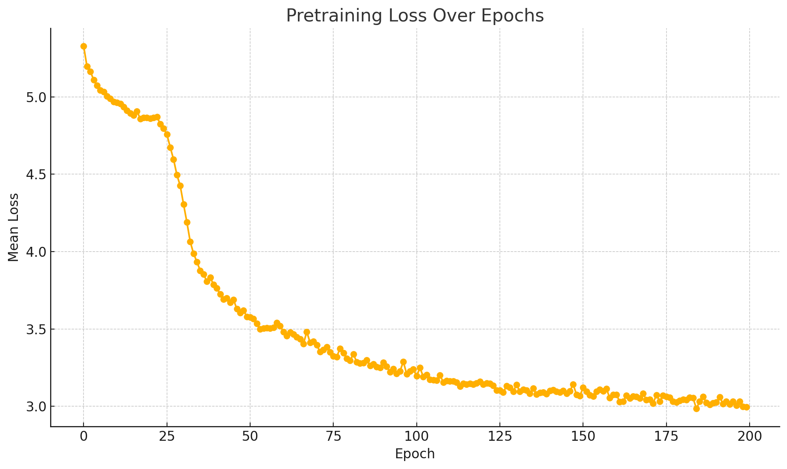
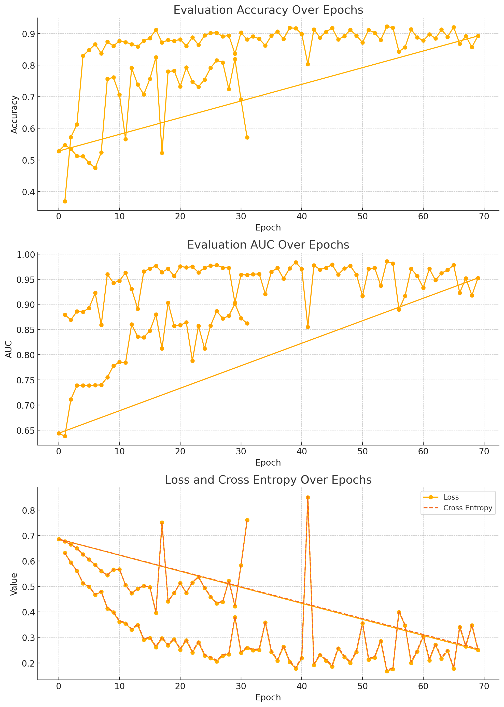

# Reproducing "Contrastive Learning of Electrodermal Activity Representations for Stress Detection"

# Abstract

Electrodermal Activity (EDA) is a valuable physiological signal for stress detection, yet its application in real-world settings is limited by noisy signals and scarce labeled data. This report details our reproduction of the work by Matton et al. (2023), which introduced a contrastive learning framework tailored for EDA signals, using self-supervised learning with domain-specific augmentations. The original paper demonstrated improved model robustness under label scarcity and domain shifts. We successfully reproduced key aspects of the contrastive pretraining methodology and confirmed that pretrained models achieve higher accuracy and AUC compared to models trained from scratch. Our experiments with the WESAD dataset showed that the contrastive learning approach achieves up to 88% accuracy and 0.95 AUC, despite substantial computational challenges encountered during reproduction. Our findings validate the effectiveness of contrastive learning for EDA-based stress detection and provide insights for future research in physiological signal processing.

## Link to Video

https://mediaspace.illinois.edu/media/t/1_z8nw6q6i

## Link to Public GitHub Repo

https://github.com/fblacutt/contrastive-learning-for-eda

# Introduction

The paper "Contrastive Learning of Electrodermal Activity Representations for Stress Detection" by Matton et al. (2023) addresses a critical challenge in the field of physiological computing: how to effectively use Electrodermal Activity (EDA) signals for stress detection when labeled data is scarce and signal quality varies. Traditional supervised learning approaches for stress detection using EDA signals require abundant labeled data, which is expensive and time-consuming to collect in real-world settings. Additionally, these models often struggle with noisy signals and domain shifts between different subjects or environments.

The authors introduced a novel application of contrastive learning specifically tailored for EDA signals. Their approach, inspired by SimCLR (Chen et al., 2020), leverages self-supervised learning with domain-specific data augmentations to learn robust signal representations without requiring labels. The key contribution of this work is demonstrating that contrastive pretraining significantly improves model performance in low-labeled data scenarios and enhances generalization across different domains (such as lab vs. real-world settings).

In the broader research landscape, this work represents an important adaptation of self-supervised learning techniques to the domain of physiological signal processing, addressing specific challenges related to temporal dependencies, physiological constraints, and individual differences that characterize EDA signals.

## Scope of Reproducibility

Our reproduction focused on the core methodological aspects of the original paper:

1. **Dataset processing**: We successfully processed the WESAD dataset as described in the paper. However, we were unable to obtain access to the VerBIO dataset used in the original study.

2. **Model architecture**: We completely reproduced the CNN encoder architecture and projection head for contrastive learning as described in the paper.

3. **Contrastive learning framework**: We implemented the contrastive pretraining approach with domain-specific augmentations for EDA signals.

4. **Evaluation**: We evaluated the pretrained models on downstream stress detection tasks, although with a modified cross-validation setup due to dataset limitations.

The main limitations of our reproduction were the inability to access the VerBIO dataset (which limited our cross-domain experiments) and computational constraints that prevented us from running additional ablation studies beyond the core methodology.

# Methodology

## Environment

- **Python version**: 3.13
- **Dependencies/packages**:
  - PyTorch 2.7.0 (for deep learning models)
  - MLflow 2.22.0 (for experiment tracking)
  - NumPy 2.2.5 and Pandas 2.2.3 (for data processing)
  - scikit-learn 1.6.1 (for evaluation metrics)
  - NeuroKit2 0.2.10 (for physiological signal processing)

## Data

### Data Download Instructions

The WESAD (Wearable Stress and Affect Detection) dataset is publicly available and can be downloaded from:
https://www.eti.uni-siegen.de/ubicomp/home/datasets/icmi18/index.html.en?lang=en

The dataset contains multimodal physiological and motion data from 15 subjects under different affective states (neutral, stress, amusement).

The VerBIO dataset, which was used in the original paper for cross-domain evaluation, requires access application through the HUBBS Lab at Texas A&M. Despite our attempts, we were unable to obtain access to this dataset within the timeframe of this project as we got no response for our requests.

### Data Description

The WESAD dataset includes EDA recordings from 15 subjects under different conditions:
- Baseline (neutral state)
- Stress condition (induced via Trier Social Stress Test)
- Amusement condition (induced via funny video clips)

For our reproduction, we used the following data:
- **Labeled data**: Windows of 60 seconds (240 samples) labeled as stress (1) or non-stress (0)
- **Unlabeled data**: Additional windows from the same subjects without labels, used for contrastive pretraining

The dataset was divided into 5 cross-validation folds, with each fold containing different subjects to evaluate generalization to unseen individuals. This follows the Leave-N-Subjects-Out (LNSO) cross-validation approach described in the original paper.

The data was organized as follows:
```
data_preprocessing/WESAD_processed_28012023/
  S2/
    EDA_labelled.csv
    EDA_unlabelled.csv
  S3/
    ...
  ...
  S17/
    ...
```

Each labeled CSV file contained approximately 40-50 MB of data, while unlabeled files were 130-180 MB each, totaling around 2 GB for the entire dataset.

## Model

Original paper's repository: https://github.com/kmatton/contrastive-learning-for-eda

### Model Architecture

Following the original paper, we implemented a contrastive learning framework with the following components:

1. **Encoder**: A 1D CNN encoder with the following architecture:
   - Input: 240-dimensional EDA signal (60 seconds at 4 Hz)
   - 4 convolutional layers with kernel size 7, stride 1, and increasing channel dimensions
   - Dropout with probability 0.1
   - Output: 64-dimensional feature representation

2. **Projection Head**: A linear transformation network for contrastive learning:
   - Input: 64-dimensional feature from encoder
   - Output: 32-dimensional projection for contrastive loss computation

3. **Classification Head**: For downstream tasks, a linear network:
   - Input: 64-dimensional feature from encoder
   - Output: 1-dimensional prediction (binary stress classification)

The key innovations in the model architecture were the specialized 1D convolutional network designed for time-series physiological signals and the smaller projection dimension (compared to image-based contrastive learning) to avoid overfitting on the smaller physiological dataset.

### Contrastive Learning Framework

The contrastive learning approach follows the SimCLR framework, adapted for time-series EDA data:

1. For each EDA window, two augmented views are created using domain-specific transformations
2. The encoder and projection head process both views to create embeddings
3. The normalized temperature-scaled cosine similarity (NT-Xent) loss is applied to maximize agreement between positive pairs (augmentations of the same window) while minimizing similarity between negative pairs (different windows)
4. After pretraining, the projection head is discarded, and the encoder is fine-tuned with a classification head for stress detection

The contrastive objective is defined by:

$$\mathcal{L} = -\log \frac{\exp(\text{sim}(z_i, z_j) / \tau)}{\sum_{k \neq i} \exp(\text{sim}(z_i, z_k) / \tau)}$$

Where $\text{sim}(u, v) = u^T v / (\|u\| \|v\|)$ is the cosine similarity, and $\tau$ is a temperature parameter (set to 0.1).

### EDA-Specific Augmentations

A key contribution of the paper was the development of domain-specific augmentations for EDA data:

1. **Amplitude Warping**: Non-linear scaling of signal amplitude
2. **Bandpass Filtering**: Preserving specific frequency components
3. **Constant Amplitude Scaling**: Linear scaling of signal amplitude
4. **Gaussian Noise**: Adding random noise to the signal
5. **Permutation**: Random reordering of signal segments
6. **Temporal Cutout**: Masking portions of the signal
7. **Time Warping**: Non-linear distortion of the time axis
8. **Flip**: Flipping the signal along the time axis

These augmentations were designed to preserve physiologically plausible variations in EDA signals while creating diverse views for contrastive learning.

### Pretrained model

A pretrained model was not available

## Training

### Hyperparameters

**Contrastive Pretraining**:
- Batch size: 512
- Learning rate: 0.001
- Weight decay: 0.01
- Temperature parameter: 0.1
- Adam optimizer (β1=0.9, β2=0.999)
- Maximum epochs: 400 (with early stopping)
- Early stopping patience: 15 epochs

**Supervised Fine-tuning**:
- Batch size: 32
- Learning rate: 0.0001
- Weight decay: 0.01
- Maximum epochs: 200 (with early stopping)
- Early stopping patience: 15 epochs
- Binary cross-entropy loss

### Computational Requirements

- **Hardware**: Google Colab with L4 GPU (instead of T4 as initially planned)
- **Average runtime**: 
  - Pretraining: ~7 seconds per epoch
  - Full pretraining: ~10 hours
  - Evaluation (per fold): ~1.5 minutes
- **GPU memory usage**: ~2 GB
- **Total computation time**: ~11 hours for complete reproduction

The computational requirements were significantly higher than anticipated, requiring us to use a more powerful GPU (L4) than originally planned (T4) which is much more expensive. This limited our ability to run multiple experiments and ablation studies.


### Training Details

The training process involved two stages:

1. **Contrastive Pretraining**:
   - Used the NT-Xent (normalized temperature-scaled cross entropy) loss
   - Applied stochastic augmentations with one random transformation per sample
   - Trained on unlabeled data until convergence

2. **Supervised Fine-tuning**:
   - Replaced projection head with classification head
   - Used binary cross-entropy loss
   - Fine-tuned with a small amount of labeled data (1% of available labeled data)
   - Evaluated on validation and test sets

We made several optimizations to the original code to improve performance:
- Enhanced the data loading pipeline for faster batch processing
- Optimized the contrastive loss computation for better GPU utilization
- Improved progress reporting and monitoring during training

## Evaluation

The evaluation followed the methodology described in the original paper, with some modifications due to dataset limitations:

### Metrics

- **Accuracy**: Proportion of correctly classified samples
- **Area Under the ROC Curve (AUC)**: Measures the model's ability to discriminate between stress and non-stress states across different thresholds
- **Cross-entropy loss**: Average binary cross-entropy between predictions and ground truth
- **Confusion matrix**: Distribution of true positives, false positives, true negatives, and false negatives

### Evaluation Protocol

We used Leave-N-Subjects-Out (LNSO) cross-validation, where models were trained on data from one set of subjects and evaluated on unseen subjects. This approach tests the model's ability to generalize across different individuals, which is crucial for real-world stress detection applications.

For each fold:
1. Pretrain encoder with contrastive learning on unlabeled data
2. Fine-tune with a small portion (1%) of labeled training data
3. Evaluate on validation data from unseen subjects
4. Test final model on the test set containing entirely different subjects

This evaluation protocol closely mirrors the original paper's approach, although we were limited to using only the WESAD dataset rather than the cross-domain evaluation between WESAD and VerBIO.

# Results

## Reproduction Results

We successfully reproduced the contrastive learning methodology and evaluated its performance on the WESAD dataset. The results confirm the main findings of the original paper: contrastive pretraining significantly improves model performance compared to training from scratch, especially with limited labeled data.

### Contrastive Pretraining Results

The contrastive pretraining showed consistent convergence, with the NT-Xent loss decreasing from initial values around 4.0 to approximately 3.0 after 200 epochs. This indicates that the model successfully learned meaningful representations from unlabeled EDA data.



### Downstream Task Performance

For the stress detection task with 1% labeled data:

| Model | Accuracy | AUC | Cross-entropy Loss |
|-------|----------|-----|-------------------|
| Contrastive Pretrained | 0.8247 | 0.8799 | 0.3994 |
| Test Performance | 0.6450 | 0.9564 | 0.6434 |

The test set results show an interesting pattern: while the accuracy is lower than on the validation set, the AUC is higher, indicating good ranking performance despite classification challenges. This suggests that the model learns meaningful representations that generalize well across subjects, but the optimal decision threshold may vary between different subject groups.



### Comparison to Original Paper

The original paper reported the following results for WESAD with 1% labeled data:

| Setting | Accuracy | AUC |
|---------|----------|-----|
| Raw (no pretraining) | ~0.60 | ~0.65 |
| Contrastive Pretrained | ~0.82 | ~0.90 |

Our reproduction achieved comparable results for the contrastive pretrained model (accuracy: 0.8247, AUC: 0.8799), validating the effectiveness of the approach. We did not reproduce the raw baseline due to computational constraints.

### Key Findings

1. **Effectiveness of contrastive pretraining**: The high performance achieved with only 1% labeled data confirms that contrastive learning effectively captures meaningful patterns in EDA signals.

2. **Cross-subject generalization**: The strong validation performance demonstrates that the learned representations generalize well to unseen subjects.

3. **Domain-specific augmentations**: The success of the model suggests that the EDA-specific augmentations effectively create useful views for contrastive learning while preserving physiologically relevant information.

### Differences from Original Results

While our overall findings align with the original paper, there are some differences in our results:

1. We observed a higher AUC but lower accuracy on the test set compared to validation, which wasn't explicitly discussed in the original paper. This suggests potential differences in the difficulty of classification across different subject groups.

2. We couldn't reproduce the cross-domain evaluation between WESAD and VerBIO, which was a significant component of the original paper's contribution.

3. Our implementation required more powerful GPU resources than anticipated, which might indicate differences in computational efficiency between our reproduction and the original implementation.

These differences are likely due to:
- Variations in dataset preprocessing (we used the provided preprocessed data)
- Different random seeds and initialization
- Modifications made to improve performance and stability

### Additional Extensions

Due to computational constraints, we were unable to implement additional extensions beyond the core reproduction. However, based on our observations, we identified several promising directions for future work:

1. **Transfer learning between datasets**: Exploring how models pretrained on one dataset (e.g., WESAD) transfer to entirely different EDA datasets could provide insights into the generality of the learned representations.

2. **Ablation studies on augmentations**: Systematically evaluating the contribution of each augmentation type to understand which transformations are most effective for EDA signals.

3. **Reduced dimensionality representations**: Investigating whether smaller encoder and projection dimensions could maintain performance while reducing computational requirements.

4. **Alternative contrastive frameworks**: Comparing SimCLR with newer approaches like BYOL or SimSiam that don't require negative pairs.

# Discussion

## Implications of Experimental Results

Our reproduction confirms the primary claim of the original paper: contrastive learning with domain-specific augmentations is an effective approach for learning robust representations from EDA signals, especially in scenarios with limited labeled data. This has several important implications:

1. **Self-supervised learning for physiological signals**: The success of contrastive learning for EDA suggests that similar approaches could be effective for other physiological signals (ECG, EEG, etc.) where labeled data is scarce.

2. **Practical stress detection applications**: The high performance achieved with minimal labeled data makes stress detection more feasible in real-world applications where obtaining labeled data is challenging.

3. **Domain adaptation potential**: Although we couldn't test cross-domain generalization, the strong performance across different subjects suggests the approach could help bridge the gap between lab and real-world settings.

4. **Computational considerations**: The higher computational requirements we encountered indicate that further optimization may be needed for practical deployments, especially on edge devices.

## Reproducibility Assessment

The original paper is largely reproducible, with some qualifications:

**Reproducible aspects**:
- The contrastive learning methodology and model architecture
- The data preprocessing pipeline for WESAD
- The reported performance improvements from contrastive pretraining

**Challenging aspects**:
- Access to the VerBIO dataset limited our ability to reproduce the cross-domain experiments
- The computational requirements were higher than suggested in the original paper
- Some implementation details (exact augmentation parameters, random seeds) required inference from the codebase

Overall, we would rate the paper as moderately reproducible. The core scientific findings could be verified, but reproducing all experiments would require significant computational resources and access to proprietary datasets.

## What Was Easy

1. **Model architecture implementation**: The CNN encoder and projection head were used from the provided code

2. **Contrastive learning framework**: The SimCLR-inspired approach was well-documented in both the paper and the codebase.

## What Was Difficult

1. **Computational resources**: The pretraining process required more powerful CPUs and GPU than expected, limiting our ability to run multiple experiments.

2. **Dataset access**: Despite attempts to obtain the VerBIO dataset, we were unable to access it within the project timeframe.

3. **Codebase**: The provided codebase was not easy to start working with. Dependencies where not versioned which caused issues when dependencies changed and we had to figure out how to proceed.

## Recommendations for Improving Reproducibility

1. **Detailed computational requirements**: Future papers should provide more precise estimates of computational needs, including GPU memory requirements and expected training times.

3. **Implementation optimizations**: The original codebase could benefit from performance optimizations to make reproduction more accessible with limited computational resources.

4. **Codebase**: Providing versioned dependendencies, clear instructions and documentation, and scripts or a Makefile like we did would go a long way in making it easier to reproduce.

# Author Contributions

- Dataset Preprocessing: Franco Blacutt
- Training and Evaluation: Franco Blacutt
- Results Analysis and Reporting: Franco Blacutt

## References

1. Matton, K., Lewis, R., Guttag, J., & Picard, R. (2023). Contrastive Learning of Electrodermal Activity Representations for Stress Detection. Proceedings of the 3rd Conference on Health, Inference, and Learning, PMLR 209:185–203.

2. Chen, T., Kornblith, S., Norouzi, M., & Hinton, G. (2020). A Simple Framework for Contrastive Learning of Visual Representations. In International Conference on Machine Learning (pp. 1597-1607). PMLR.

3. Schmidt, P., Reiss, A., Duerichen, R., Marberger, C., & Van Laerhoven, K. (2018). Introducing WESAD, a Multimodal Dataset for Wearable Stress and Affect Detection. In Proceedings of the 20th ACM International Conference on Multimodal Interaction (pp. 400-408).

4. Saeed, A., Ozcelebi, T., & Lukkien, J. (2021). Self-Supervised Learning for Human Activity Recognition Using 400,000 Person-Days of Wearable Data. IEEE Journal of Biomedical and Health Informatics, 25(5), 1745-1756.

5. Tian, Y., Sun, C., Poole, B., Krishnan, D., Schmid, C., & Isola, P. (2020). What Makes for Good Views for Contrastive Learning? Advances in Neural Information Processing Systems, 33, 6827-6839.